# Utilisation

```
python3 -m venv env_idl_tp_final             
source env_idl_tp_final/bin/activate
pip install -r requirements.txt
```

# Résultats

Cinq modèles ont été entraînés et évalués.

Le classifieur LinearSVC est celui qui s'est le mieux débrouillé sur la validation croisée et les tests sur le data set split en 75/25, avoisinant les 90% et 95% d'*accuracy* respectivement.

Les modèle de regression logistique et NuSVC présente des résultats plus ou moins similaires, quoique 1 à 3% moins bons.

Le modèle SVC, après affinement, passe d'environ 75% à 85% d'*accuracy*, soit le modèle le plus impacté par l'édition de l'hyperparamètre 'C'.

Enfin, le RandomForest est le moins performant, mais reste autour des 80% d'*accuracy* sur une validation croisée.

L'affinement des hyperparamètres a éte concluant sur les modèles type SVC mais moins sur la forêt d'arbre de décisions, et a donc été omis de la présentation des résultats.

Par ailleurs, l'ajout de features à l'aide de spacy et son implémentation au sein du dataframe utilisé venait greffer de manière significative les résultats (de 15 à 30% moins peformants). Cette implémentation n'a donc pas été retenue.

## LinearSVC

Pré traitement minime (lower case / suppression ponctuation)

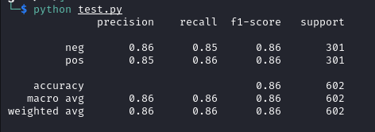

Pré traitement nlp pipeline (cf. supra + lemmatisation & suppression de mots vides, meilleur de 3% sur validation croisée)

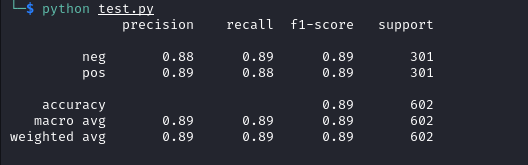

Optimisation rudimentaire des hyperparamètres

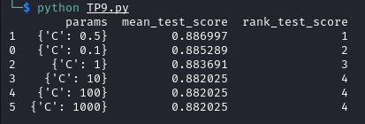

Après affinement

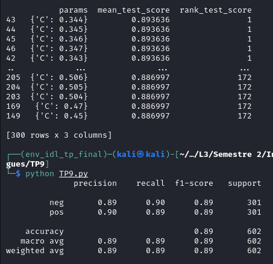

## Logistic Regression

Avant affinement

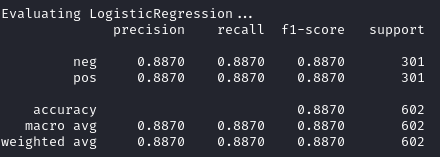

Après affinement avec optimisaton des hyperparamètres

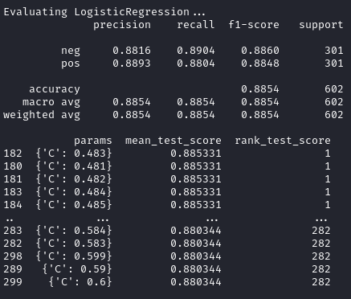

## SVC Kernel

Avant affinement

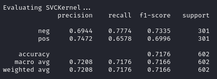

Après affinement avec optimisaton des hyperparamètres

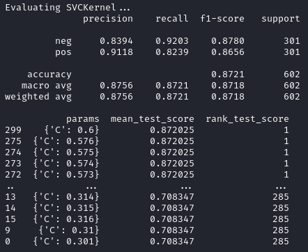

## NuSVC

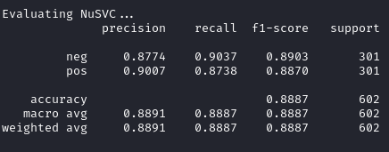

## Random Forest

Avant affinement

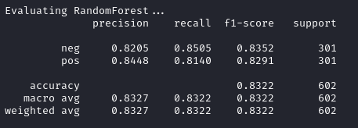

## Vectorisation

On peut remarquer que le modèle bag of words performe moins bien que TF-IDF.

### TF IDF

Dans le cas de TfidfVectorizer(), une valeur de max_df en dessous de 0.5 affecte négativement les valeurs, mais le contraire n'est pas vrai : il n'y a aucune amélioration notable en augmentant max_df (vu que les mots trop fréquents sont potentiellement des mots vides, et donc déjà exclus du vocabulaire).


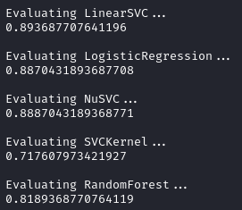

### CountVectorizer

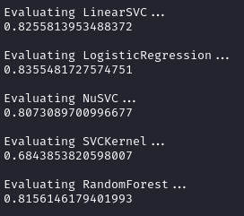